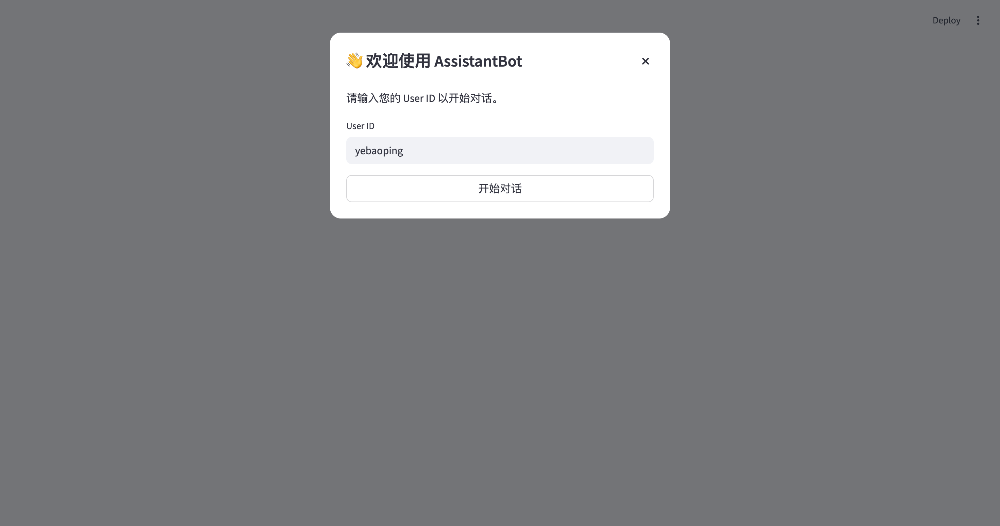
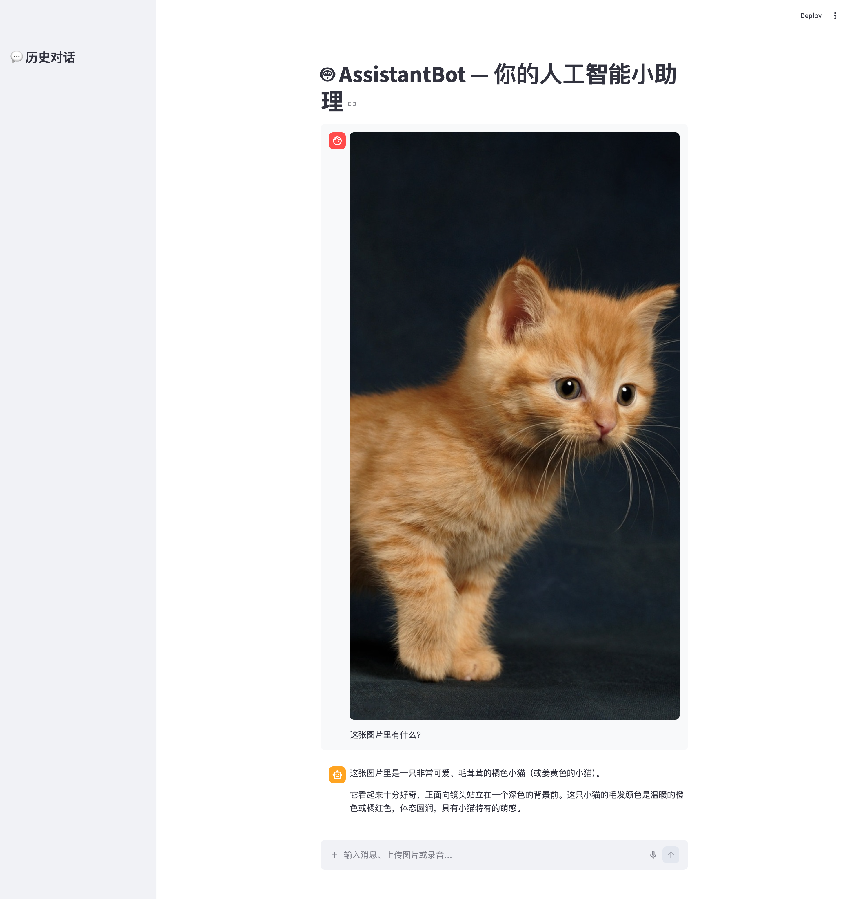
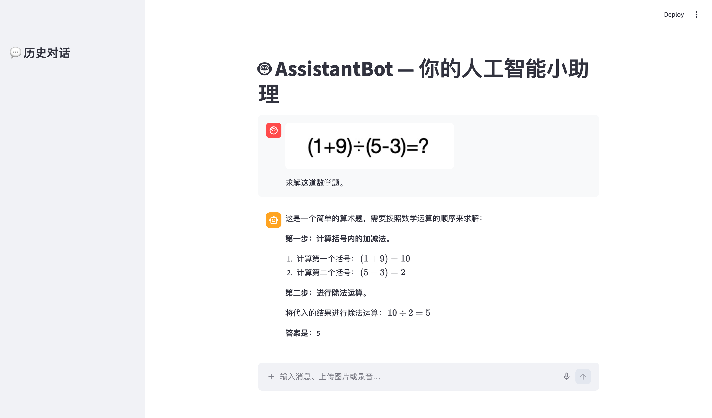
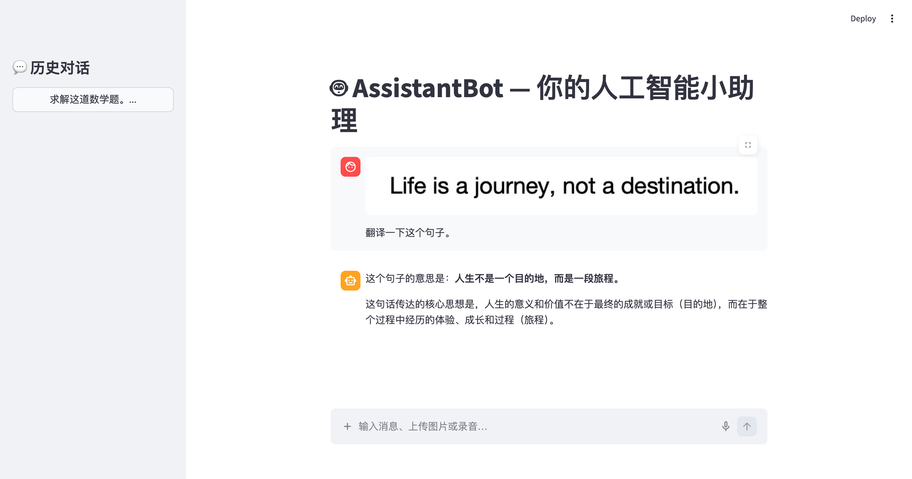
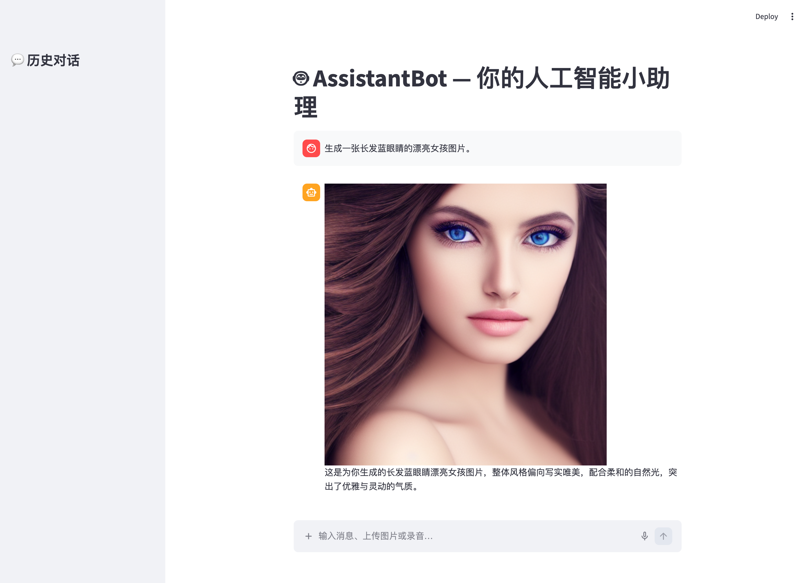
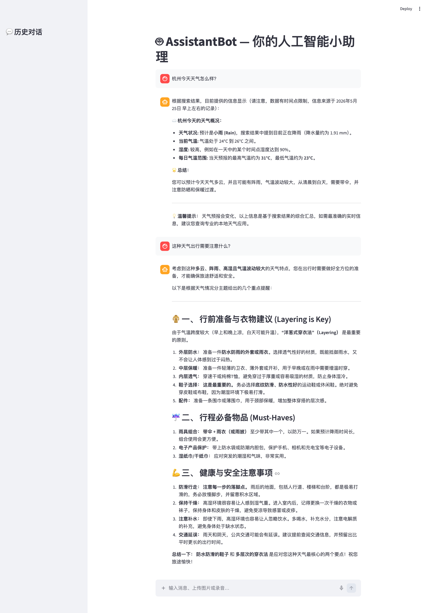
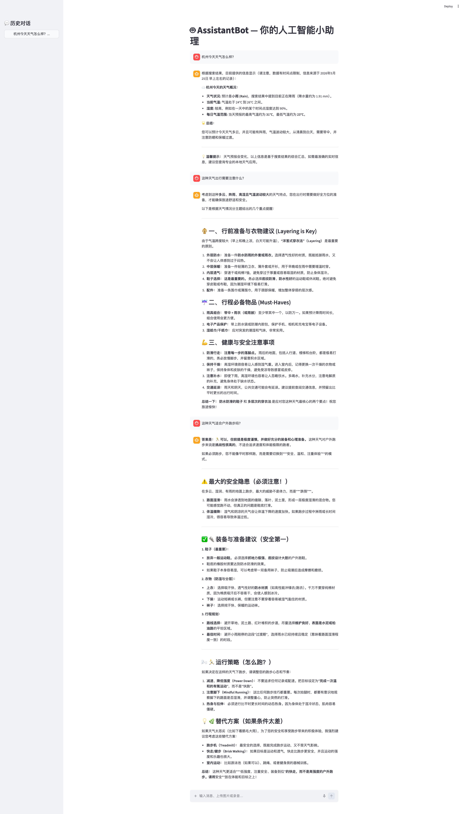

# 🤖 AssistantBot

在线问答机器人

- 支持多用户，用户会话和状态相互隔离；

  

- 支持多模态输入（文本、图片(OCR)、语音）；

  
  
  

- 支持生成文本和图片；

  

- 上下文会话记忆，支持连续对话；

  

- 会话历史，支持继续对话；

  

- 模型动态切换，不同任务使用不同的模型（支持OpenAI、Anthropic、DeepSeek、Ollama）；

- 支持browser-use和computer-use（在沙盒中操作和执行）；

- 支持skills；

##### 主要组件

- framework - langchain
- workflow - langgraph
- models - openai + anthropic + deepseek + ollama + vllm + stable diffusion
- memory - mem0
  - vector_store - qdrant
  - llm - ollama (gemma4:e4b)
  - embedder - vllm (Qwen3-Embedding-0.6B)
  - reranker - vllm (Qwen3-Embedding-0.6B)

- sandbox - daytona
- audio - whisper
- browser-use - playwright
- trace - langfuse
- webpage - streamlit
- rest api - fastapi
- deploy - docker

###### TODO

- 输出支持TTS；

- 支持长任务和离线任务；

- 使用AIO替换Daytona和Playwright及其他browser-use和computer-use功能；

- 使用Google Serper替换Tavily；